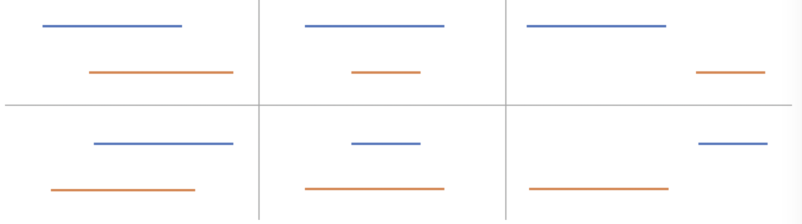

# 6 overlaps possibilites


56.Merge Interval and 57.Insert Interval is similar. For 57, Just need to insert the interval to the correct position of given interval and then use the 56 algorithm will be find. Or use greedy.

* 57 can use greedy algorithm to do it. But need to take full care of 6 overlapping possibilites.

* when using for/while-loop, be careful of the situation where len=0/1


```python
def mergable(l0, l1):
    if l0[0] >= l1[0]:
        l0, l1 = l1, l0
    return l0[0] <= l1[1]


def merge(l0, l1):
    if l0[0] >= l1[0]:
        l0, l1 = l1, l0
    return [l0[0], max(l1[1], l0[1])
```

# Other Links:
1. [zhihu note][zhihu-note]

[zhihu-note]: https://zhuanlan.zhihu.com/p/114704401